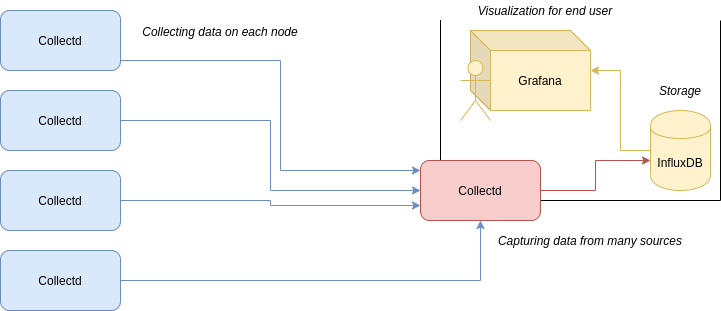

# collectd-aggregator

Collectd server that **aggregates** results of other collectd instances and passes to InfluxDB or other database that supports collectd.

The aggregator is filled-in with red color on diagram below.




```bash
docker pull quay.io/riotkit/collectd-aggregator:v1.1
```

```yaml
version: '2.4'

services:
    collectd_aggregator:
        image: quay.io/riotkit/collectd-aggregator:v1.1
        volumes:
            - ./auth_file:/etc/collectd/auth_file:ro
        environment:
            FORWARD_ADDRESS: influxdb
            FORWARD_PORT: 25826
    
            # optional
            FORWARD_USER: 'riotkit'
            FORWARD_PASSWORD: 'we-all-work-on-our-wealthy-masters'
        ports:
            - 25826:25826/udp
```

**Available versions:** https://quay.io/repository/riotkit/collectd-aggregator?tab=tags

## Hints on InfluxDB configuration

This is a minimum configuration for InfluxDB, so it could take the data from the aggregator:

```ini
[[collectd]]
  enabled = true
  bind-address = ":25826"
  database = "collectd"
```

In internal docker network possibly you do not need authorization between Collectd and InfluxDB if InfluxDB is not exposing the ports to the host.

## Architecture

Works as an aggregator of other collectd instances data.
On worker nodes the collectd instances should send the collected data using encrypted channel to this aggregator instance.
Then this aggregator instance should send the data to InfluxDB or other database.

## Setup

1. Set environment variables

```bash
# address where to pass the data eg. InfluxDB instance
FORWARD_ADDRESS=1.2.3.4 
FORWARD_PORT=25826

# optional
FORWARD_USER=riotkit
FORWARD_PASSWORD=we-all-work-on-our-wealthy-masters
```

2. Mount `/etc/collectd/auth_file` file with credentials

Example:
```
user:passwd
iwa:workers_united_cannot_be_defeated

```

https://collectd.org/wiki/index.php/Networking_introduction#Cryptographic_setup

3. Run!

Copyleft
--------

Created by **RiotKit Collective**, a libertarian, grassroot, non-profit organization providing technical support for the non-profit Anarchist movement.

Check out those initiatives:
- International Workers Association (https://iwa-ait.org)
- Federacja Anarchistyczna (http://federacja-anarchistyczna.pl)
- Związek Syndykalistów Polski (https://zsp.net.pl) (Polish section of IWA-AIT)
- Komitet Obrony Praw Lokatorów (https://lokatorzy.info.pl)
- Solidarity Federation (https://solfed.org.uk)
- Priama Akcia (https://priamaakcia.sk)
